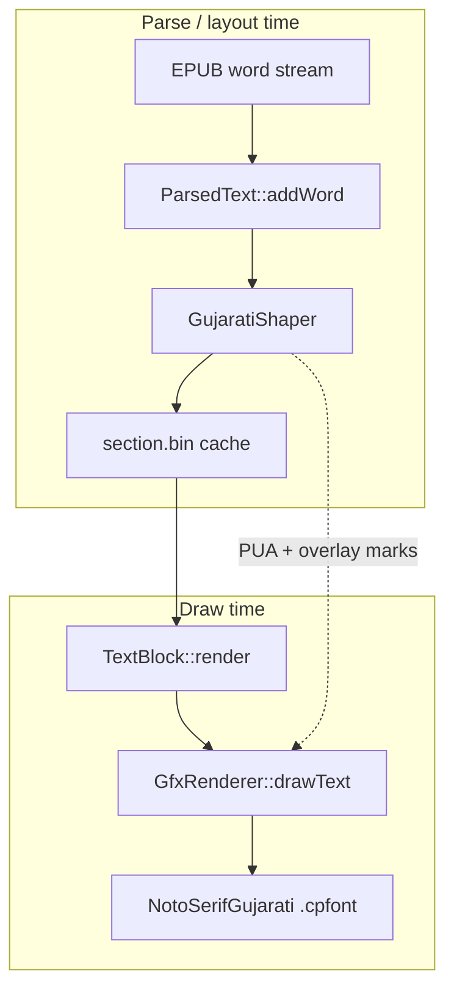

# Gujarati rendering

Gujarati EPUB support for CrossPoint Reader and CrossPoint-based firmware (CrossInk, inx, custom forks). The implementation is **modular**: the shaper lives in a self-contained library; upstream touch points are small, documented hooks.

## What you get

- Conjunct ligatures (e.g. `ક્ષ`, `સ્ત્ર`) via PUA glyphs — no tofu boxes
- Pre-base `િ` matra in correct order
- Reph (`ર+્`), subjoined Ra (`ટ્ર`), anusvara (`ં`), chandrabindu (`ઁ`)
- Shaped text cached in `section.bin` at layout time (fast re-reads)
- **Noto Serif Gujarati** SD-card font with matching PUA conjuncts

## Architecture



| Layer | Responsibility | Upstream coupling |
|-------|----------------|-------------------|
| **GujaratiShaper** | GSUB-derived conjunct rules, matra reorder, reph | None — copy `lib/GujaratiShaper/` |
| **GujaratiIntegration** | `shapeWord()` / `shapeUiString()` helpers | 1 line in ParsedText; optional UI hooks |
| **GfxRenderer** | Zero-advance overlays (reph, anusvara, subjoined Ra) | ~60 lines in `drawText` / `getTextAdvanceX` |
| **Font pipeline** | PUA embedding in `.cpfont` | `sd-fonts.yaml` entry + `fontconvert_sdcard.py` |
| **Section cache** | Version bump when shaping output changes | `SECTION_FILE_VERSION` in `Section.cpp` |

---

## Quick start (readers)

1. **Flash** firmware that includes Gujarati rendering (this branch or a release that ships it).
2. **Install font** — Settings → System → Manage Fonts → download **NotoSerifGujarati**, or copy `NotoSerifGujarati_*.cpfont` to `/.fonts/NotoSerifGujarati/` on the SD card ([crosspoint-fonts](https://github.com/crosspoint-reader/crosspoint-fonts)).
3. **Select font** — Settings → Reader → Font Family → **NotoSerifGujarati**.
4. **Clear cache** after upgrading from an older build: delete `.crosspoint/` on the SD card (or per-book `sections/` under `.crosspoint/epub_<hash>/`).
5. Open a Gujarati EPUB.

---

## Porting to a fork (CrossPoint, CrossInk, inx, …)

### 1. Copy the shaper module (required)

Copy the entire directory:

```
lib/GujaratiShaper/
```

PlatformIO picks up all `lib/*` components automatically. No `platformio.ini` changes needed.

### 2. Wire ParsedText (required)

In `lib/Epub/Epub/ParsedText.cpp`, inside `addWord()` after NFC compose:

```cpp
#include "GujaratiIntegration.h"

// …
GujaratiIntegration::shapeWord(word);
```

### 3. Bump section cache version (required)

In `lib/Epub/Epub/Section.cpp`:

- Increment `SECTION_FILE_VERSION` from whatever it currently is in your tree
  (check the constant directly — this doc will drift out of sync with it).
- Add a one-line changelog comment (v35+ history documents Gujarati bumps).
- Document the bump in `docs/file-formats.md`.

Any change to shaper output or overlay drawing invalidates cached sections for Gujarati books.

### 4. GfxRenderer overlays (required)

In `lib/GfxRenderer/GfxRenderer.cpp`:

- `#include "GujaratiGlyphs.h"`
- In `drawText()`: track `lastCons*` / `lastSyllable*` / `prevCp`; handle `utf8IsGujaratiReph`, `utf8IsGujaratiSubjoinedRa`, `utf8IsGujaratiSyllableMark` as zero-advance overlays before the main glyph loop body.
- In `getTextAdvanceX()`: skip overlay codepoints (zero width).

Search the CrossPoint tree for `utf8IsGujarati` to find the exact blocks to cherry-pick.

`resolveTextFontId()` should route strings with missing glyphs to the SD fallback font (same pattern as CJK UI fallback).

### 5. Font pipeline (required)

**This repo's actual pipeline does not match a generic `sd-fonts.yaml` /
`build-sd-fonts.py` integration** — there is no `pua_mapping` key in
`lib/EpdFont/scripts/sd-fonts.yaml` and `build-sd-fonts.py` never references
PUA mapping at all. Reading pipeline (via `Makefile:130-183`, targets
`generate-fonts` / `generate-rss-font`) instead shells out to **out-of-tree**
tooling that is not part of this checkout:

| Makefile variable | Points at |
|---|---|
| `FONT_CATALOG` | a `gujarati-fonts.json` catalog (external) |
| `FONT_BUILDER` | `build-gujarati-fonts.py` (external) |
| `RSS_FONT_BUILDER` | `build-rss-list-font.py` (external) |
| `FALLBACK_REGULAR` / `FALLBACK_BOLD` | a local Noto Serif Gujarati checkout |

`fontconvert_sdcard.py` in this repo *is* present and does support
`--pua-mapping` and a `gujarati` interval preset (`0x0A80–0x0AFF`) — those
pieces of the checklist below are accurate — but nothing in-tree drives it
with a Gujarati PUA mapping automatically; the external `FONT_BUILDER`/
`RSS_FONT_BUILDER` scripts do that.

| File | Change |
|------|--------|
| `lib/EpdFont/scripts/fontconvert_sdcard.py` | `gujarati` interval preset (`0x0A80–0x0AFF`), `--pua-mapping`, sorted PUA intervals |

Build fonts (this repo, reproducible only if you have the external tooling above):

```bash
make prepare-fonts    # requires FONT_CATALOG, FONT_BUILDER, FALLBACK_REGULAR/BOLD env vars
make generate-rss-font
```

If you are porting to a fork that uses the generic `sd-fonts.yaml` /
`build-sd-fonts.py` pipeline instead, wire `pua_mapping` through there per the
original design intent — that path is not exercised by this checkout.

### 6. UI shaping hooks (recommended)

Strings that bypass ParsedText need explicit shaping:

| File | Call |
|------|------|
| `src/components/themes/BaseTheme.cpp` | `GujaratiIntegration::shapeUiString(title)` before status-bar title |
| `src/activities/reader/EpubReaderChapterSelectionActivity.cpp` | `shapeUiString` on TOC title lambda |
| `src/activities/reader/XtcReaderChapterSelectionActivity.cpp` | `shapeUiString` on chapter name |

Forks with different UI should call `shapeUiString()` anywhere Gujarati text is passed to `drawText()` without going through ParsedText.

### 7. SD font fallback probe (recommended)

In `src/SdCardFontSystem.cpp`, include Gujarati in the script probe (e.g. codepoint `0x0A95` KA) so UI strings containing Gujarati use the SD font when built-ins lack glyphs.

### 8. Tests (recommended)

```bash
# Copy test/gujarati_shaper/ and add_subdirectory in test/CMakeLists.txt
cd test && cmake -B build && cmake --build build --target GujaratiShaperTest
./build/gujarati_shaper/GujaratiShaperTest
```

---

## File manifest (cherry-pick checklist)

### New files

```
lib/GujaratiShaper/GujaratiShaper.h
lib/GujaratiShaper/GujaratiShaper.cpp
lib/GujaratiShaper/GujaratiShapingData.h
lib/GujaratiShaper/GujaratiGlyphs.h
lib/GujaratiShaper/GujaratiIntegration.h
lib/GujaratiShaper/GujaratiIntegration.cpp
lib/GujaratiShaper/README.md
lib/GujaratiShaper/scripts/extract_shaping_rules.py
lib/GujaratiShaper/scripts/pua_mapping.json
test/gujarati_shaper/GujaratiShaperTest.cpp
test/gujarati_shaper/CMakeLists.txt
docs/gujarati-rendering.md
```

### Modified files

```
lib/Epub/Epub/ParsedText.cpp
lib/Epub/Epub/Section.cpp
lib/GfxRenderer/GfxRenderer.cpp
lib/EpdFont/scripts/sd-fonts.yaml
lib/EpdFont/scripts/fontconvert_sdcard.py
lib/EpdFont/scripts/build-sd-fonts.py
src/SdCardFontSystem.cpp
src/components/themes/BaseTheme.cpp
src/activities/reader/EpubReaderChapterSelectionActivity.cpp
src/activities/reader/XtcReaderChapterSelectionActivity.cpp
test/CMakeLists.txt
docs/file-formats.md
```

---

## Merging strategies

### Upstream CrossPoint PR

Submit as a single PR with the manifest above. Keep GfxRenderer changes in clearly labelled `// Gujarati` regions. Reference Malayalam PR #1756 as the prior art.

### CrossInk / inx / custom fork

1. Merge or rebase onto latest CrossPoint `develop`.
2. Copy `lib/GujaratiShaper/` if not already present.
3. Apply GfxRenderer + ParsedText + Section hooks (use `git diff` against CrossPoint branch).
4. Reconcile UI files if your fork replaced activities/themes — only the `shapeUiString()` calls are required.
5. Build and ship NotoSerifGujarati fonts (CI or manual).
6. Bump `SECTION_FILE_VERSION` if your fork’s version diverged — use a **fork-specific** version only if you cannot align with upstream; otherwise match CrossPoint’s number to ease future merges.

### Staying cohesive with upstream

- **Do not** fork `GujaratiShaper.cpp` logic into GfxRenderer or ParsedText — keep shaping in the library.
- **Do** use `GujaratiIntegration::shapeWord()` / `shapeUiString()` at integration points.
- **Regenerate** `GujaratiShapingData.h` and fonts together; never update one without the other.
- **Document** any fork-only UI hook in your fork’s README with a link back to this file.

---

## Cache version history (Gujarati)

| Version | Change |
|---------|--------|
| 35 | Initial Gujarati shaping in ParsedText |
| 36–40 | Matra order, reph, subjoined Ra, anusvara experiments |
| 41 | Reph virama tails; chapter UI shaping; U+0AC2 as uu matra |
| 42 | Pre-base matra / anusvara anchor fixes |
| 43 | Anusvara/chandrabindu after below-base matras anchor to the current syllable |
| **44** | Anusvara/chandrabindu use the active font's native glyph bearing |
| **45** | Reph overlays use the active font's native pen position after the target syllable |

After any firmware upgrade that changes versions ≥ 35, delete `.crosspoint/` on the SD card.

---

## Troubleshooting

| Symptom | Likely cause | Fix |
|---------|--------------|-----|
| Tofu boxes in body text | Font missing PUA glyphs | Rebuild `.cpfont` with `pua_mapping.json`; reinstall font |
| Broken conjuncts, correct letters | Shaper/font mismatch | Regenerate `GujaratiShapingData.h` + fonts from same TTF |
| Broken chapter titles only | UI not shaped | Add `shapeUiString()` at draw site |
| Old layout after flash | Stale section cache | Delete `.crosspoint/` |
| Latin UI suddenly wrong font | Fallback too aggressive | Ensure `resolveTextFontId` only redirects when primary lacks the codepoint |

---

## Related docs

- [SD card fonts](sd-card-fonts.md) — install paths and font manager
- [File formats](file-formats.md) — `section.bin` version field
- [lib/GujaratiShaper/README.md](../lib/GujaratiShaper/README.md) — module API and regeneration
